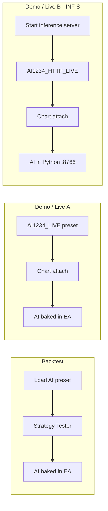

# ORBVWAP

> **Opening Range Breakout × Session VWAP** · EURUSD M1 · PROD v3 + four-layer AI overlay  
> **Bundle** `orbvwap-v1.23-ai1234` · **EA** v1.23 · **INF-GATE** PASS

[](STATUS.md)
[](Diagnostics/AI-test-journal.csv)
[](Diagnostics/ai/INF-8-runbook.md)
[](STATUS.md)

---

## At a glance

| | |
|---|---|
| **What it is** | Session-filtered ORB strategy with VWAP confirmation and a stacked AI overlay (gate · size · regime · exit). |
| **Where it runs** | MetaTrader 5 — Strategy Tester, demo chart, or live account. |
| **Validated window** | ~6 years (train + walk-forward); pre-2015 backtests are stress tests, not sign-off targets. |
| **Signed core** | `AI1234_SHADOW` · n≈315 · PF≈1.53 · DD≈5.9% · net≈46% (Tester) |
| **Live deploy options** | Compiled preset **or** Python HTTP full stack (no recompile on retrain) |

---

## Three ways to run it



| Mode | Preset example | Python needed? | Recompile after retrain? |
|------|----------------|----------------|--------------------------|
| **Backtest** | `AI1234_SHADOW` / `AI1234_LIVE` | No | Yes (if models change) |
| **Demo / Live (simple)** | `AI1234_LIVE` | No | Yes |
| **Demo / Live (runtime)** | `AI1234_HTTP_LIVE` | **Yes** — `ai_inference_server.py` | **No** — restart server only |

> **Rule of thumb:** Backtest and compiled live = **preset only**. HTTP live = **preset + server**.

Presets live in `Presets/` and are mirrored to `MQL5/Profiles/Tester/` for MT5 **Inputs → Load**.

---

## AI layers

```
Session bar closes
       │
       ▼
  ┌─────────┐     skip messy days
  │  AI-3   │ ── regime filter
  └────┬────┘
       ▼
  ┌─────────┐     block weak entries
  │  AI-1   │ ── entry gate (score 0–1)
  └────┬────┘
       ▼
  ┌─────────┐     scale lot by score tier
  │  AI-2   │ ── position sizing
  └────┬────┘
       ▼
    OPEN TRADE
       │
       ▼
  ┌─────────┐     stall scratch exit
  │  AI-4   │ ── trade management
  └─────────┘
```

Each layer has **OFF · SHADOW · LIVE** (preset-controlled). SHADOW logs decisions without changing trades; LIVE applies them.

| Layer | Question it answers | LIVE effect |
|-------|---------------------|-------------|
| **AI-1** | Is this entry good enough? | Blocks low-score signals |
| **AI-2** | How confident? | Scales lot (1.0× / 1.15× / 1.25×) |
| **AI-3** | Is the session chop? | Skips the session |
| **AI-4** | Is the trade stalling? | Closes scratch losers early |

---

## Preset ladder

| Step | Preset | AI-1 | AI-2 | AI-3 | AI-4 | Use |
|:----:|--------|:----:|:----:|:----:|:----:|-----|
| 0 | `PROD_EURUSD-M1` | — | — | — | — | Baseline, no AI |
| 3 | `AI123_SHADOW` | LIVE | SHADOW | LIVE | — | Tester gate |
| 4 | **`AI1234_SHADOW`** | LIVE | SHADOW | LIVE | SHADOW | **Signed core** |
| 7 | `AI1234_SIZING_LIVE` | LIVE | LIVE | LIVE | SHADOW | Sizing gate ✅ |
| 8 | `AI1234_LIVE` | LIVE | LIVE | LIVE | LIVE | Full compiled stack |
| 8′ | **`AI1234_HTTP_LIVE`** | LIVE | LIVE | LIVE | LIVE | Same as step 8, brain in Python |

---

## Quick start

### Backtest with AI (no Python)

1. Compile EA — **F7** on `ORBVWAP.mq5`
2. Strategy Tester → **ORBVWAP** · **EURUSD** · **M1**
3. **Inputs → Load** → e.g. `ORBVWAP_AI1234_SHADOW_PROD_EURUSD-M1.set`
4. Run · optional shadow audit:

```powershell
cd Experts\ORBVWAP
python Diagnostics/ai/audit_shadow.py "%APPDATA%\MetaQuotes\Terminal\Common\Files\Logs\ORBVWAP_ai_shadow.csv"
```

### Demo / live — compiled (no server)

1. Attach **ORBVWAP** to EURUSD M1 chart
2. **Inputs → Load** → `ORBVWAP_AI1234_LIVE_PROD_EURUSD-M1.set`
3. Enable Algo Trading

### Demo / live — full stack from Python (INF-8)

1. Start server (keep terminal open):

```powershell
cd Experts\ORBVWAP
python Scripts/ai_inference_server.py
```

2. MT5 → **Tools → Options → Expert Advisors** → allow `http://127.0.0.1:8766`
3. Attach EA · **Inputs → Load** → `ORBVWAP_AI1234_HTTP_LIVE_PROD_EURUSD-M1.set`
4. Experts tab should show: `AI runtime=HTTP full stack (AI-1..AI-4 from Python)`

Health check:

```powershell
curl http://127.0.0.1:8766/health
```

Retrain loop: update `models/ai*_v1.json` → **restart server** → no EA recompile.

---

## Project status

Live dashboard: **[STATUS.md](./STATUS.md)** · regenerate with `make status`

| Gate | Verdict | Notes |
|------|---------|-------|
| INF-0 … INF-7 | **PASS** | Schema, replay, golden CI, parity, walk-forward, bundle |
| INF-8 (optional) | **PASS** | Full-stack HTTP · `make test-ipc` (9 tests) |
| AI1234_SHADOW | **PASS** | Primary Tester sign-off |
| Chart steps 6 & 8 | **Pending** | Demo shadow audit on weekday sessions |

**Ancient backtests** (e.g. 2015–2020): expect thinner edge (PF ~1.0–1.1) — different market era, not overfitting proof. Sign-off metrics apply to the **~6y design window**.

---

## Repository map

```
ORBVWAP/
├── README.md              ← you are here
├── ORBVWAP.mq5            EA entry
├── STATUS.md              generated gate dashboard
├── AGENTS.md              agent / developer map
├── System Design.md       wiring, INF phases, INF-GATE
├── System Profile.md      PROD v3 frozen edge
├── aidesign.md            AI training design
├── ailayers.md            AI-0…AI-4 checklist
├── Include/ORBVWAP/       MQL5 modules + Ai*.mqh
├── Presets/               .set files (mirror → Profiles/Tester/)
├── models/                ai*_v1.json + manifest.json
├── Scripts/               build_bundle, status, inference server
├── Diagnostics/ai/        train, replay, audit, walk-forward
├── tests/                 pytest gates
└── Makefile               make replay-all | test-ipc | status …
```

---

## Make commands

```bash
make install          # locked Python deps
make replay-all       # INF-2 offline replay
make test-golden      # INF-3 regression snapshots
make parity-check     # INF-4 Py ↔ MQL5 features
make walkforward      # INF-5 OOS gate
make test-ipc         # INF-8 sidecar + full stack (9 tests)
make status           # refresh STATUS.md
```

---

## Documentation index

| Doc | Read when you want… |
|-----|---------------------|
| [Multi_Symbols_Guide.md](./Multi_Symbols_Guide.md) | Portfolio expansion, symbol tiers, correlation |
| [README.md](./README.md) | Overview, quick start, preset ladder |
| [STATUS.md](./STATUS.md) | Current gate verdicts |
| [System Design.md](./System%20Design.md) | INF phases, sign-off wiring, architecture |
| [System Profile.md](./System%20Profile.md) | PROD geometry, baseline metrics |
| [aidesign.md](./aidesign.md) | Model training, ablation, gates |
| [ailayers.md](./ailayers.md) | Per-layer task IDs |
| [Diagnostics/ai/README.md](./Diagnostics/ai/README.md) | Python CLI (train, replay, audit) |
| [Diagnostics/ai/INF-8-runbook.md](./Diagnostics/ai/INF-8-runbook.md) | Sidecar + HTTP server ops |
| [AGENTS.md](./AGENTS.md) | Repo rules for coding agents |

---

## Critical rules

1. **PROD v3 geometry is frozen** — no signal/exit changes without edge review.
2. **Tester PASS ≠ chart LIVE** — demo sign-off still required for steps 6 & 8.
3. **Deploy unit = bundle** — `ORBVWAP_BUNDLE_ID` in EA must match `models/manifest.json`.
4. **HTTP does not work in Strategy Tester** — use compiled presets or AI-1 sidecar for Tester IPC tests.

---

<p align="center">
  <sub>ORBVWAP · Opening Range Breakout × VWAP · MetaTrader 5</sub>
</p>
