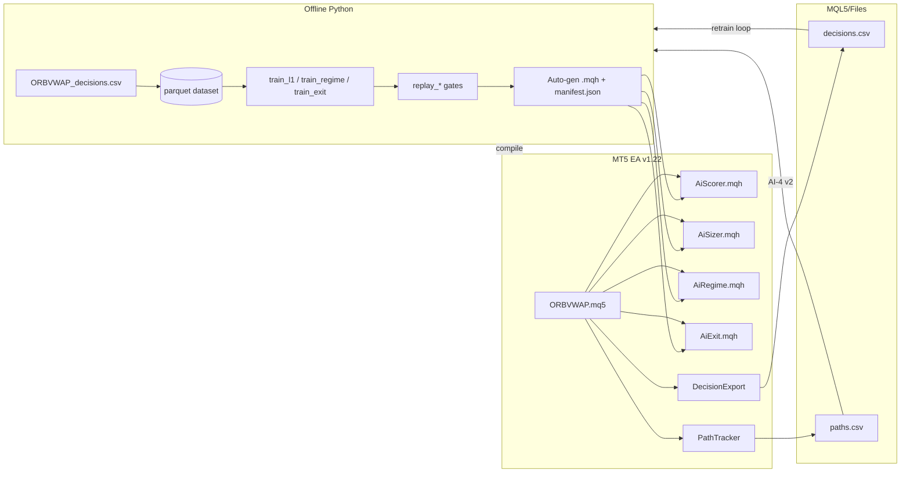

# ORBVWAP — AI Design & System Architecture

**Document:** `aidesign.md`  
**EA version:** 1.22 · **Production stack:** PROD v3 (frozen signal/exit geometry)  
**AI status:** Offline training **CLOSED** (2026-06-11) · MT5 validation **partial** · LIVE promotion **pending**  
**References:** [System Design.md](./System%20Design.md) · [ailayers.md](./ailayers.md) · [System Profile.md](./System%20Profile.md) · [Edge Discovery.md](./Edge%20Discovery.md)

> **Doc ownership:** This file owns **AI model design and training gates**. Wiring / INF pipeline → [System Design.md](./System%20Design.md). PROD edge metrics → [System Profile.md](./System%20Profile.md). Agent commands → [AGENTS.md](./AGENTS.md).

**Chart LIVE:** Blocked until **INF-GATE PASS** — see [System Design.md §6](./System%20Design.md#6-infrastructure-phases-inf-).

---

## 1. Purpose

This document describes how AI intelligence is integrated into ORBVWAP: the EA infrastructure, the four AI layers, trade profiles at each stage, and how Python offline training, MT5 backtesting, and proposed live deployment connect — **without** replacing the proven ORB/VWAP execution engine.

**Design intent:** AI is a **versioned policy overlay** that skips bad sessions, bad entries, scales size on confidence, and optionally scratches stalled losers. It improves **profit factor and drawdown**, not headline win rate alone.

---

## 2. Design principles

| Principle | Implementation |
|-----------|----------------|
| **Frozen execution** | `SignalEngine`, SL/TP geometry, time stop (120 min), session filters unchanged until an AI phase passes its gate |
| **Protection, not replacement** | Block worst ~8–12% tail (sessions / scores / stalls); retain ≥85–90% of PROD trade flow |
| **Offline first** | Train in Python on exported CSV → policy replay on time holdout → journal PASS → MT5 shadow → LIVE |
| **No runtime Python (v1)** | Models compile to auto-generated `.mqh` constants and decision trees — zero socket/ONNX in v1 |
| **Time-based splits only** | Earliest 70% train · latest 30% holdout — no random shuffle |
| **Gate on PF + payoff + DD** | Win rate is informational; geometry caps WR ~55% |
| **One task → one journal row** | Same discipline as P2/P4 edge discovery |

---

## 3. System architecture

### 3.1 Layer stack

```
┌─────────────────────────────────────────────────────────────┐
│  MARKET DATA (EURUSD M1)                                     │
└───────────────────────────────┬─────────────────────────────┘
                                ▼
┌─────────────────────────────────────────────────────────────┐
│  PROD v3 — FROZEN BELOW AI WIRE                              │
│  SessionUtils → OpeningRange → SessionVwap → SignalEngine    │
│  EntryFilters (SpreadRange20) → RiskEngine → MinRR 0.9       │
└───────────────────────────────┬─────────────────────────────┘
                                ▼  candidate setup
┌─────────────────────────────────────────────────────────────┐
│  AI-3  Regime gate     skip choppy ORB sessions              │
└───────────────────────────────┬─────────────────────────────┘
                                ▼  session allowed
┌─────────────────────────────────────────────────────────────┐
│  AI-1  Signal scorer   score ∈ [0,1] · block if score < τ   │
└───────────────────────────────┬─────────────────────────────┘
                                ▼  score pass
┌─────────────────────────────────────────────────────────────┐
│  AI-2  Dynamic sizer   lot × {1.0, 1.15, 1.25} by percentile │
└───────────────────────────────┬─────────────────────────────┘
                                ▼
┌─────────────────────────────────────────────────────────────┐
│  ExecutionEngine — market entry · SL/TP · 120m time stop     │
└───────────────────────────────┬─────────────────────────────┘
                                ▼  position open
┌─────────────────────────────────────────────────────────────┐
│  AI-4  Exit overlay    stall scratch @ 45m if MFE < 0.25×R   │
│  PathTracker           MFE/MAE sampling every tick             │
└───────────────────────────────┬─────────────────────────────┘
                                ▼
                         Trade close (TP / SL / time / AI-4)
```

**Runtime order in `ORBVWAP.mq5`:**

1. **Every tick:** `ManageOpenPositions` → PathTracker update → AI-4 → PROD exits  
2. **New bar:** `ProcessPipeline` → AI-3 → risk/setup → AI-1 → AI-2 → execute → AI-0 export log

### 3.2 EA infrastructure

| Component | File | Role |
|-----------|------|------|
| **Orchestrator** | `ORBVWAP.mq5` v1.22 | `OnInit` / `OnTick` / `OnTradeTransaction` / pipeline |
| **Types & inputs** | `Types.mqh`, `Inputs.mqh`, `Constants.mqh` | Enums, PROD defaults, AI mode inputs |
| **Session & signal** | `SessionUtils`, `OpeningRange`, `SessionVwap`, `SignalEngine`, `EntryFilters` | PROD edge (unchanged) |
| **Risk & state** | `RiskEngine`, `StateTracker`, `CircuitBreakers` | Sizing, gates, one-trade-per-session |
| **Execution** | `ExecutionEngine.mqh` | Entry, time stop, AI-4 stall scratch |
| **AI-0 export** | `DecisionExport.mqh` | `ORBVWAP_decisions.csv` + outcomes |
| **AI-1** | `AiScorer.mqh` | Logistic score + τ=0.30 |
| **AI-2** | `AiSizer.mqh` | Percentile lot multipliers |
| **AI-3** | `AiRegime.mqh` | Decision-tree chop probability |
| **AI-4** | `AiExit.mqh`, `PathTracker.mqh` | Stall rule + path CSV export |
| **Logging** | `Logger.mqh` | Experts tab + optional file journal |

**Global objects:** `g_indicators`, `g_opening_range`, `g_session_vwap`, `g_state`, `g_breakers`, `g_executor`.

**AI control inputs (`Inputs.mqh`):**

| Input | Values | Layer |
|-------|--------|-------|
| `InpEnableDecisionExport` | bool | AI-0 |
| `InpAiGateMode` | OFF / SHADOW / LIVE | AI-1 |
| `InpAiMinScore` | 0 = model τ | AI-1 |
| `InpAiSizeMode` | OFF / SHADOW / LIVE | AI-2 |
| `InpAiRegimeMode` | OFF / SHADOW / LIVE | AI-3 |
| `InpAiExitMode` | OFF / SHADOW / LIVE | AI-4 |
| `InpEnablePathExport` | bool | AI-4 training data |

**Mode semantics:**

| Mode | Value | Behaviour |
|------|-------|-----------|
| OFF | 0 | Layer inactive — pure PROD |
| SHADOW | 1 | Log decision; **do not** block / scale / close |
| LIVE | 2 | Apply policy — block, scale lot, or close |

---

## 4. AI layer implementation

### 4.1 AI-0 — Pipeline & dataset (foundation)

**Purpose:** Reproducible decision-level dataset and offline policy replay without re-running MT5 for every model iteration.

**Flow:**

1. MT5 backtest with `InpEnableDecisionExport=true` → `MQL5/Files/ORBVWAP_decisions.csv` + outcomes  
2. `build_dataset.py` → `Diagnostics/datasets/ORBVWAP_ai_dataset_v1.parquet`  
3. `replay_policy.py` → baseline PROD metrics on holdout  
4. `train_eval.py` → shared time-split harness  
5. `models/manifest.json` → version registry  

**Row definition:** One row per candidate setup at signal time (16,565 rows · 358 executed in v1 export).

**Status:** Offline ✅ CLOSED · **Undone:** re-export v2 when candidate-setup logging or new window.

---

### 4.2 AI-1 — Signal quality scorer (L1)

**Model:** Logistic regression → exported weights in `AiScorer.mqh`  
**Model ID:** `ai1_v1` · **Threshold:** τ = **0.30** (protection cap — blocks ~9% worst scores)

**Features (computed identically in EA and Python):**

`range_width_atr`, `vol_ratio`, `vwap_dist_atr`, `spread_pct_range`, `min_rr_at_entry`, `hour_gmt`, `weekday`, `session_ny`, `direction_sell`, `ny_min_since_open`

**EA hook (`ProcessPipeline`):**

```cpp
ai_score = CAiScorer::Score(...);
ai_pass  = (ai_score >= min_score);
// SHADOW: log only
// LIVE:   ai_blocked = true → skip OpenMarket
```

**Offline gate:** Holdout n=98 · PF=**1.49** · 91% retain vs PROD holdout PF=1.39  

**Status:** Offline ✅ · MT5 ✅ (`AI-123-005`: 342t PF=1.33) · **Undone:** walk-forward 3 folds · PROD preset LIVE

---

### 4.3 AI-2 — Dynamic position sizing (L2)

**Model:** Score percentile bins (no ML at runtime) → `AiSizer.mqh`

| Score vs train | Lot multiplier |
|----------------|----------------|
| &lt; p50 (0.549) | **1.00×** |
| p50 – p80 | **1.15×** |
| ≥ p80 (0.635) | **1.25×** |

**EA hook:** After AI-1 pass, `setup.lot = ScaleLots(setup.lot, CAiSizer::Multiplier(ai_score))` in LIVE mode.

**Offline gate:** AI-1+AI-2 holdout PF=**1.47** · payoff=**1.20** · net=**12.79**

**Status:** Offline ✅ · MT5 ⬜ (`AI12` shadow undone) · LIVE ⬜

---

### 4.4 AI-3 — Regime / session gate (L3)

**Model:** Depth-3 decision tree → `ChopProbability()` in `AiRegime.mqh`  
**Rule:** Skip session if chop_prob ≥ **0.60**

**Features:** `range_width_atr`, `vol_ratio`, `spread_pct_range`, `vwap_dist_atr`, `weekday`, `session_ny`, `prior_session_loss`

**EA hook:** Runs **before** setup build — earliest filter in AI stack:

```cpp
regime_ok = CAiRegime::AllowFromPipeline(...);
// LIVE + !regime_ok → return (skip entire session)
```

**Offline gate:** Holdout n=97 · PF=**1.43** · maxCL **5→4** · AI-3+AI-1 stack PF=**1.52**

**Status:** Offline ✅ · MT5 ✅ (`AI-1234-005`: 315t PF=**1.53** DD=**5.89%**) · LIVE ⬜

---

### 4.5 AI-4 — Stall-scratch exit overlay (L4)

**Model:** Rule-based (not ML at runtime) — parameters from `train_exit.py` → `AiExit.mqh`

| Parameter | Value |
|-----------|-------|
| Stall window | **45 minutes** in trade |
| MFE threshold | **&lt; 0.25 × opening range width** |
| Action | Full market close (not partial TP) |

**PathTracker:** Every tick updates MFE/MAE; snapshots at 15/30/45/60 min; on close writes `ORBVWAP_paths.csv` if `InpEnablePathExport=true`.

**EA hook (`ManageOpenPositions`, before PROD time stop):**

```cpp
scratch = CAiExit::ShouldStallScratch(hold_min, mfe_frac);
// SHADOW: log "AI4 shadow STALL"
// LIVE:   PositionClose(ticket)
```

**Offline gate (AI-3+AI-1 stack holdout):** PF 1.52→**2.51** · payoff 1.21→**2.00** · max_dd 3.20→**1.42** *(v1 used proxy path MFE — treat as optimistic)*

**Status:** Offline ✅ *(proxy)* · MT5 ✅ log only · **Undone:** real path export v2 · LIVE stall closes · promote last

---

## 5. Trade profiles

All metrics on **6-year EURUSD M1** window unless noted. Compare like-for-like window only.

### 5.1 PROD v3 baseline (no AI)

| Metric | Value |
|--------|-------|
| Trades | **358** |
| Profit factor | **1.29** |
| Win rate | **53.9%** |
| Max equity DD | **8.56%** |
| Payoff (avg win / \|avg loss\|) | ~**1.09** (MT5 AI123 run on PROD-like stack) |
| Avg hold | ~43 min (capped at 120 min time stop) |
| Session days | Mon, Tue, Thu (Wed+Fri skipped) |
| Entries | ~09:00–18:00 GMT · NY delay 30 min |

**Character:** Low-frequency ORB · one trade per session · short-heavy mix (structural, P4C NO-STACK) · tail loss outlier **−5.19** vs avg loss **~0.67**.

---

### 5.2 Layer profiles (offline holdout)

| Profile | n (holdout) | PF | Notes |
|---------|-------------|-----|-------|
| PROD holdout | 100 | 1.43 | AI-0 replay reference |
| **+ AI-1** (τ=0.30) | 98 | **1.49** | 91% retain · DD 3.92 |
| **+ AI-1 + AI-2** | 98 | **1.47** | Payoff 1.20 · net 12.79 |
| **+ AI-3** alone | 97 | **1.43** | maxCL 5→4 |
| **+ AI-3 + AI-1** | 88 | **1.52** | DD 3.20 · stack base for AI-4 |
| **+ stack + AI-4** | 88 | **2.51** | Payoff 2.00 · DD 1.42 *(proxy paths)* |

---

### 5.3 MT5 validated profiles (tester)

| Preset | LIVE layers | n | PF | WR | Max DD | Net ($200) | Avg hold |
|--------|-------------|---|-----|-----|--------|------------|----------|
| PROD ref | — | 358 | 1.29 | 53.9% | 8.56% | — | ~43 min |
| `AI123_SHADOW` | AI-1 | 342 | 1.33 | 55.0% | 8.34% | 34.28 | ~43 min |
| **`AI1234_SHADOW`** | **AI-1 + AI-3** | **315** | **1.53** | **58.1%** | **5.89%** | **46.33** | **~36 min** |

**Journal rows:** `AI-123-005`, `AI-1234-005` in `Diagnostics/AI-test-journal.csv`.

**Deploy candidate profile (AI-1 + AI-3 LIVE):**

- **−12% trades** vs PROD (315 vs 358) — still ~88% of flow  
- **+19% PF** vs PROD · **−31% DD** vs PROD  
- Largest loss **unchanged at −5.19** (AI-4 still SHADOW) — exit overlay is the remaining tail-risk lever  
- Sharpe **17.9** · Recovery **3.57** on AI1234 run  

---

### 5.4 Proposed LIVE stack profile (not yet run)

| Stage | Layers LIVE | Expected direction |
|-------|-------------|-------------------|
| **Stage 1** | AI-1 + AI-3 | Match AI1234 tester metrics · promote in PROD preset |
| **Stage 2** | + AI-2 sizing | Payoff/net ↑ · monitor DD with 1.25× cap |
| **Stage 3** | + AI-4 stall scratch | Trim −5.19 tail · avg hold may drop further · **last** |

**Promotion rule:** One layer at a time · journal row per MT5 run · no retrain+wire in same step.

---

## 6. Communication model: offline · backtest · live

AI does **not** call Python at runtime in v1. Communication is **artifact-based**: Python trains → exports `.mqh` + JSON → MetaEditor compile → EA embeds policy.

### 6.1 Architecture diagram



### 6.2 Offline training (CLOSED)

| Step | Actor | Data flow |
|------|-------|-----------|
| 1. Export | MT5 tester + `AI0_Export` preset | EA writes CSV → copied to `Diagnostics/` |
| 2. Build | `build_dataset.py` | CSV → parquet with labels |
| 3. Train | `train_l1.py`, `train_regime.py`, `train_exit.py` | parquet → JSON metrics + **regenerate `.mqh`** |
| 4. Gate | `replay_policy.py`, `replay_regime.py`, `replay_sizing.py`, `replay_exit.py` | Holdout metrics → `AI-test-journal.csv` PASS/REJECT |
| 5. Version | `models/manifest.json` | Records model_id, τ, features, gate verdict |

**No EA connection during replay** — Python recomputes policy on stored rows using the same feature definitions as MQL5.

**Retrain trigger:** New export · merged `ORBVWAP_paths.csv` · +N live trades → repeat steps 2–5 → new manifest version → shadow → LIVE.

---

### 6.3 Backtest (Strategy Tester)

Three distinct backtest **modes**:

| Mode | Preset pattern | AI behaviour | Purpose |
|------|----------------|--------------|---------|
| **Export** | `AI0_Export` | AI OFF · `InpEnableDecisionExport=true` | Build training data |
| **Shadow** | `AI1/12/123/1234_SHADOW` | Promoted layers LIVE · new layers SHADOW (log only) | Validate wiring + journal row |
| **LIVE sign-off** | `AI123_LIVE` → `AI1234_SIZING_LIVE` → `AI1234_LIVE` | Layers promoted one stage at a time | Tester then demo/live chart |

**Communication path in tester:**

1. EA reads **compiled constants** from `.mqh` (τ, tree thresholds, stall minutes) — no file I/O for inference  
2. SHADOW layers write to **Experts tab** (`AI1 shadow`, `AI3 shadow`, `AI4 shadow STALL`)  
3. Optional export: `MQL5/Files/ORBVWAP_decisions.csv`, `ORBVWAP_paths.csv`  
4. Results compared to offline holdout via journal presets  

**Tick vs bar:**

- **AI-3, AI-1, AI-2:** evaluated on **new bar** in `ProcessPipeline`  
- **AI-4, PathTracker:** evaluated **every tick** in `ManageOpenPositions`  

---

### 6.4 Proposed live deployment

| Phase | Action | Rollback |
|-------|--------|----------|
| **L0** | Deploy EA v1.22 compiled with current `.mqh` artifacts | Revert to PROD preset (all AI OFF) |
| **L1** | Set `InpAiGateMode=LIVE` + `InpAiRegimeMode=LIVE` · preset **`AI123_LIVE`** | Set AI modes OFF → PROD preset |
| **L2** | Preset **`AI1234_SIZING_LIVE`** after Tester PASS | Set `InpAiSizeMode=OFF` |
| **L3** | Preset **`AI1234_LIVE`** · AI-4 stall LIVE last | Set `InpAiExitMode=OFF` |
| **L4** | Enable `InpEnableDecisionExport` on live (optional) for retrain | File-only side effect |

**v1 live constraints:**

- No socket, no ONNX, no external API  
- Policy changes require **retrain → recompile → redeploy**  
- Circuit breakers (P2D) remain available but OFF on PROD cadence  
- Forward demo (P3-004) remains user-triggered slippage gate  

**v2 (future runtime inference):** HTTP on live chart · `FILE_COMMON` sidecars in Tester — see [§6.5](#65-sign-off-wiring-chart--connection-rules).

---

### 6.5 Sign-off wiring chart & connection rules

#### v1 (current · EA v1.22) — compile-time `.mqh`

**No sidecars.** Tester and live use the **same preset**; inference is embedded in `AiScorer.mqh`, `AiRegime.mqh`, `AiSizer.mqh`, `AiExit.mqh`. After retrain: re-export `.mqh` → **recompile EA** → load preset.

| Step | Preset | AI-1 | AI-2 | AI-3 | AI-4 | Environment | Sign-off |
|------|--------|------|------|------|------|-------------|----------|
| 0 | `PROD_EURUSD-M1` | OFF | OFF | OFF | OFF | Tester / live | PROD baseline |
| 1 | `AI0_Export` | OFF | OFF | OFF | OFF | Tester · export ON | Dataset |
| 2 | `AI1_SHADOW` | SHADOW | OFF | OFF | OFF | Tester | Log scores = PROD n |
| 3 | `AI123_SHADOW` | LIVE | SHADOW | SHADOW | OFF | Tester | ✅ `AI-123-005` |
| 4 | `AI1234_SHADOW` | LIVE | SHADOW | LIVE | SHADOW | Tester | ✅ `AI-1234-005` |
| 5 | `AI12_SHADOW` | LIVE | SHADOW | OFF | OFF | Tester | AI-2 mult log ⬜ |
| 6 | **`AI123_LIVE`** | LIVE | OFF | LIVE | OFF | **Tester → demo** | **Deploy candidate** ⬜ |
| 7 | `AI1234_SIZING_LIVE` | LIVE | LIVE | LIVE | SHADOW | Tester | Sizing + ~+18% net sim ⬜ |
| 8 | **`AI1234_LIVE`** | LIVE | LIVE | LIVE | LIVE | Tester → demo | Full stack ⬜ last |

**Mode values:** OFF=`0` · SHADOW=`1` (log only) · LIVE=`2` (block / scale / close).

**EA inputs wired per layer:**

| Layer | Input | Pipeline hook |
|-------|-------|---------------|
| AI-1 | `InpAiGateMode`, `InpAiMinScore` | `ProcessPipeline` · after setup |
| AI-2 | `InpAiSizeMode` | `ProcessPipeline` · scales `setup.lot` |
| AI-3 | `InpAiRegimeMode` | `ProcessPipeline` · before setup (session skip) |
| AI-4 | `InpAiExitMode` | `ManageOpenPositions` · tick loop |
| AI-0 | `InpEnableDecisionExport` | CSV on signal / close |
| AI-4 train | `InpEnablePathExport` | `PathTracker` on close |

**Preset locations:** `Presets/ORBVWAP_*.set` · mirror in `MQL5/Profiles/Tester/`.

**AI-2 offline sim (deploy stack):** `python Diagnostics/ai/simulate_ai2.py` — net **+18%** vs AI-3+AI-1 · all production-safety checks PASS.

---

#### v2 (planned runtime inference) — connection rules

When ORBVWAP moves to HTTP / file sidecars (same pattern as VWAPMRE):

> **Tester can't use HTTP.** EA and Python must share `Terminal\Common\Files\Logs\` via **`FILE_COMMON`**. Sidecars must accept any new `req` (**`!= last_req`**, not `>`) — otherwise IPC looks connected but every score times out to **fail-open**.

| Environment | Preset type | Transport | Before run |
|-------------|-------------|-----------|------------|
| **Strategy Tester** | Gates / LogOnly + sidecars ON | `FILE_COMMON` binary IPC | Start **both** sidecars `--mode tester` **before** Start |
| **Live / demo chart** | HTTP inference preset | `WebRequest` to local server | Start `ai_inference_server.py` · allow URL in MT5 |

**Fail-open symptom:** All scores **`1.0` / `50`** (or ORBVWAP equivalents) · Experts tab timeout spam · rules still trade but **AI did not score**.

**Prevent:**

| Do | Don't |
|----|-------|
| Live = **HTTP** preset | HTTP preset in Tester without sidecars |
| Tester = **LogOnly/Gates** + sidecars `--mode tester` | Run `ai_sidecar_health.py` **mid-backtest** |
| Recompile EA after IPC / `FILE_COMMON` changes | Assume agent `MQL5/Files/` is visible to Python |
| Wait for sidecar `listening` before Start | Use `req > last_req` handshake (use `!=`) |

**Common Files path:** `%APPDATA%\MetaQuotes\Terminal\Common\Files\Logs\`

*v1 ORBVWAP does not use this path yet — rules are in `.mqh`.*

---

## 7. Python pipeline inventory

| Script | Layer | Output |
|--------|-------|--------|
| `build_dataset.py` | AI-0 | `ORBVWAP_ai_dataset_v1.parquet` |
| `replay_policy.py` | AI-0 | Baseline replay gate |
| `train_eval.py` | AI-0 | Shared metrics / splits |
| `train_l1.py` | AI-1 | `ai1_v1.json`, `AiScorer.mqh` |
| `replay_sizing.py` | AI-2 | `ai2_v1.json`, `AiSizer.mqh` |
| `sessions.py` | AI-3 | Session labels |
| `train_regime.py` | AI-3 | `ai3_v1.json`, `AiRegime.mqh` |
| `replay_regime.py` | AI-3 | Regime ablation gate |
| `build_paths.py` | AI-4 | `ORBVWAP_ai_paths_v1.parquet` |
| `train_exit.py` | AI-4 | `ai4_v1.json`, `AiExit.mqh` |
| `replay_exit.py` | AI-4 | Exit overlay gate |
| `simulate_ai2.py` | AI-2 | Full 6y stack sizing sim + MT5 $ projection |

**Journal:** `Diagnostics/AI-test-journal.csv` — one row per task run.

**Presets:** `Presets/ORBVWAP_AI*.set` · copies in `MQL5/Profiles/Tester/`.

---

## 8. Evaluation harness

**Primary metrics (all phases):**

| Metric | Role |
|--------|------|
| Profit factor | Primary pass/fail |
| Payoff ratio | Primary for AI-2, AI-4 |
| Max equity DD | Primary for AI-3 |
| Trade count (n) | Anti-overfit · holdout n ≥ 80 |
| Win rate | Informational only |

**Ablation matrix (offline):**

```
PROD
PROD + AI-3
PROD + AI-3 + AI-1
PROD + AI-3 + AI-1 + AI-2
PROD + AI-3 + AI-1 + AI-2 + AI-4
```

**Undone before full LIVE sign-off:** Walk-forward 3 rolling windows (harness rule).

---

## 9. Risks & mitigations

| Risk | Mitigation |
|------|------------|
| Overfitting on 358 trades | Simple models · time split · min n · ablation |
| AI-4 offline optimism (proxy MFE) | Real `ORBVWAP_paths.csv` v2 before LIVE AI-4 |
| WR chasing | Gate on PF + payoff, not WR |
| AI replaces edge | Frozen signal engine; AI gates/sizes/exits only |
| Stale model | Versioned manifest + retrain cadence |
| P4A repeat (bad partials) | AI-4 is full close stall only — no runner geometry |
| Direction bias | P4C NO-STACK — no long-only ML features |

---

## 10. Status summary

| Phase | Offline | EA wired | MT5 | LIVE |
|-------|---------|----------|-----|------|
| AI-0 | ✅ CLOSED | N/A | ✅ export | N/A |
| AI-1 | ✅ CLOSED | ✅ v1.19 | ✅ partial | ⬜ |
| AI-2 | ✅ CLOSED | ✅ v1.20 | ⬜ | ⬜ |
| AI-3 | ✅ CLOSED | ✅ v1.21 | ✅ partial | ⬜ |
| AI-4 | ✅ CLOSED *(proxy)* | ✅ v1.22 | ✅ log only | ⬜ last |

**Best deploy candidate:** **AI-1 + AI-3 LIVE** — MT5 n=315 · PF=1.53 · DD=5.89%.

**Next actions (no further offline training until retrain trigger):**

1. Promote AI-1 + AI-3 in PROD preset (demo/small live)  
2. MT5 shadow `AI12` for sizing validation  
3. Path export backtest → AI-4 v2 retrain → AI-4 LIVE MT5 → promote last  

---

## 11. One-line characterisation

**ORBVWAP AI** is a **compile-time policy layer**: Python trains versioned rules exported into the EA, which applies them in SHADOW or LIVE mode over a frozen PROD v3 engine — improving **PF and DD** by skipping bad sessions and entries, scaling confident size, and (when promoted) scratching stalled losers, with **retrain** as the long-term compounding loop.
